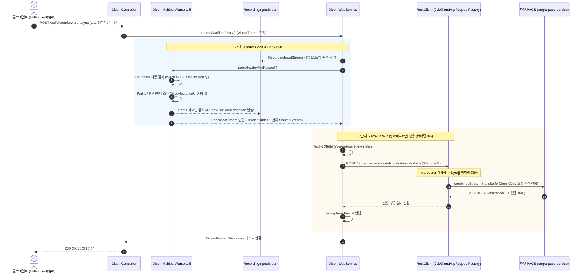

# 🏥 DICOM Proxy Service (`dicom-proxy`)

> **Java 21+ Virtual Threads**와 **dcm4che3** 기반의 **DICOM STOW-RS Zero-Copy 중계 프록시 서비스**입니다.  
> 대용량 DICOM 스터디 데이터 전송 시 메모리 버퍼링 0%의 순수 소켓 대 소켓(Socket-to-Socket) 파이프라인 스트리밍을 제공합니다.

---

## 💡 프로젝트 소개

PACS/EMR 연동 환경에서 DICOM STOW-RS 표준 규격 전송을 수행할 때, 타겟 서버의 요청 URL 경로에는 대표 `{StudyInstanceUID}`가 반드시 명시되어야 합니다:

$$\text{POST } \mathtt{/target-pacs-service/dcm/studies/}\mathbf{\{StudyInstanceUID\}}\mathtt{?SourceID=...}$$

`dicom-proxy`는 수신 스트림의 헤더를 엿보아(`Header Peek & Early Exit`) 타겟 URL을 자동 완성한 뒤, **수신 소켓 스트림에서 타겟 소켓 스트림으로 Zero-Copy 중계**를 수행합니다.

---

## 🚀 핵심 아키텍처 및 기능

### 1. ⚡ Near Zero-Copy 소켓 파이프라인 스트리밍
- `Spring RestClient` + `JdkClientHttpRequestFactory` 기반으로 구현되어, 전송 데이터를 메모리 `byte[]` 배열에 버퍼링하지 않고 **수신 소켓 ➔ 타겟 소켓으로 직접 파이프 스트리밍(`transferTo`)** 합니다.
> 📌 **Near Zero-Copy**: STOW-RS URL 구성을 위해 첫 번째 인스턴스(Part 1)의 메타데이터 파싱 용량만 메모리에 일시 캡처되며, 뒤따르는 인스턴스 및 전체 픽셀 본문 스트림은 메모리 버퍼링 0%의 소켓 파이프라인으로 직접 전달되는 **Near Zero-Copy** 메커니즘을 가집니다.

### 2. 🔍 Header Peek & Early Exit 스캔
- `RecordingInputStream`과 `dcm4che3` 파서를 결합하여 1번째 파트의 메타데이터(`StudyInstanceUID`)를 감지하는 즉시 스캔을 강제 종료(`EarlyExitScanException`)합니다.

### 3. 🔄 100% 무손실 스트림 복원 (`SequenceInputStream`)
- 단방향(Non-markable) 소켓 스트림에서 이미 읽어버린 헤더 바이트를 메모리 버퍼에 기록해 둔 뒤, 아직 읽지 않은 남은 소켓 스트림과 직렬 연결(`SequenceInputStream`)하여 **100% 완전한 무손실 스트림을 재생성**합니다.

### 4. 🛡️ 가상 스레드 & 동시성 가버너 (Semaphore Governor)
- **Virtual Threads**를 활용하여 다중 파일 요청을 스레드 생성 비용 없이 병열 처리합니다.
- `Semaphore` 기반 동시성 가버너를 적용하여 타겟 서버로의 동시 접속 폭주를 제어합니다.

---

## 📊 APM 성능 벤치마크 (Kibana APM 실측)

8개 DICOM `.dat` 파일(총 120MB+, 1,000+ 인스턴스) 동시 업로드 전송 테스트 시의 Kibana APM 실측 지표 비교입니다.

| 측정 지표 (APM Metrics) | 기존 | **최적화 완료 (Zero-Copy 실측)** | 개선 효과 |
| :--- | :---: | :---: | :---: |
| **실제 사용 힙 메모리 (Avg. Used)** | **`1.0 GB` (1,000 MB)** | **`0.24 GB` (240 MB)** | **76% 절감 📉** |
| **OS 확보 힙 메모리 (Avg. Committed)** | **`1.5 GB` (1,500 MB)** | **`0.45 GB` (450 MB)** | **70% 절감 🛡️** |
| **G1 Old Gen 메모리 점유량** | **`720.82 MB` (11.92%)** | **`82.96 MB` (1.35%)** | **88.5% 급감 ⚡** |
| **순간 메모리 할당 속도 (Allocation Rate)** | **`650 MB/sec` (폭발적 양산)** | **`19 MB/sec` (1.14 GB/min)** | **97% 급감 🚀** |
| **8개 파일 Header Peek 전체 소요 시간** | 35.9 초 | **최대 2.2 초 (동시 병열)** | **16배 속도 향상 ⏱️** |

---

## 🏗️ 시스템 아키텍처 다이어그램



---

## 🛠️ 기술 스택 (Tech Stack)

- **Language**: Java 21+ (Java 25 추천, Virtual Threads 활성화)
- **Framework**: Spring Boot 4.0.3, Spring Web / WebMVC
- **DICOM Toolkit**: `dcm4che3` (dcm4che-core 5.29.1, dcm4che-mime)
- **HTTP Client**: Spring `RestClient` + `JdkClientHttpRequestFactory` (JDK HttpClient)
- **Monitoring & Observability**: Elastic APM Java Agent, Logstash Logback ECS Encoder
- **Build Tool**: Gradle 8.x / 9.x

---

## 📖 API 사용 가이드

애플리케이션 구동 후 웹 브라우저에서 Swagger UI (`http://localhost:8080/swagger-ui.html`)에 접속하면 API를 직접 테스트해 볼 수 있습니다.

### 다중 `.dat` DICOM 파일 병열 중계 API

```http
POST /api/dicom/forward-async?SourceID=1.2.410.100110.10.xxxxxx
Content-Type: multipart/form-data

files: [study_1.2.410.xxxxxx.dat, study_1.2.410.yyyyyy.dat]
```

#### 응답 예시 (200 OK):
```json
[
  {
    "studyUid": "1.2.410.200055.900.2462313746.xxxxxx",
    "seriesUid": "1.2.410.200055.17416560743500.xxxxxx",
    "sopInstanceUid": "1.2.410.100110.10.36100137.xxxxxx",
    "results": [
      "[StudyUID: 1.2.410.200055.900.2462313746.xxxxxx] 성공 -> SOPInstanceUID: 1.2.410.100110.10.36100137.xxxxxx"
    ]
  }
]
```
응답 예시의 경우 타겟서버마다 다를 수 있습니다.

---

## ⚙️ 실행 및 배포 환경 설정

### 1. Prerequisites
- Java 25 LTS
- Gradle 8.x / 9.x

### 2. 🔧 실제 구동 시 필수 환경변수 변경 가이드

실제 운영/운영 환경에 배포 시 환경변수(`Environment Variable`) 또는 `application.yaml`에서 반드시 설정해야 하는 핵심 설정값 목록입니다.

| 환경변수 명 (`Environment Variable`) | 기본값 / 예시 설정 | 필수 여부 | 설명 |
| :--- | :--- | :---: | :--- |
| **`BASE_URL`** | `https://pacs.hospital.com:9443` | **🚨 필수** | 중계 목적지 타겟 PACS 서버의 STOW-RS Base URL |
| **`MAX_DICOM_REQUEST`** | `10` | **선택** | 사용자 PC/서버 사양에 맞춘 중계 전송 최대 동시 Semaphore 허가 개수 |
| **`PURGE_MAX_THREADS`** | `5` | **선택** | DICOM 퍼지(Purge) 아카이빙 배치 처리 시 최대 동시 작업 스레드 수 |
| **`CERTIFICATE_PATH`** | `/app/certs/server.pem` | **선택 (mTLS)** | mTLS 인증 전송 시 사용할 클라이언트 SSL/TLS 인증서 파일 경로 |
| **`CERTIFICATE_PASSWORD`** | `your_cert_password` | **선택 (mTLS)** | 클라이언트 인증서 개인키(Private Key) 비밀번호 |
| **`CAPATH`** | `/app/certs/ca.crt` | **선택 (mTLS)** | 타겟 PACS 서버의 SSL 검증용 CA 루트 인증서 경로 |
| **`DISCORD_WEBHOOK_URL`** | `https://discord.com/api/webhooks/...` | **선택** | 중계 실패 및 모니터링 알림 수신용 디스코드 웹훅 URL |
| **`SPRING_ELASTICSEARCH_URIS`** | `https://localhost:9200` | **선택 (APM)** | APM 및 트레이싱 로그 수집용 ElasticSearch 엔드포인트 |
| **`SPRING_ELASTICSEARCH_USERNAME`** | `elastic` | **선택 (APM)** | ElasticSearch 계정 ID |
| **`SPRING_ELASTICSEARCH_PASSWORD`** | `your_elastic_password` | **선택 (APM)** | ElasticSearch 계정 비밀번호 |
| **`MYSQL_DATASOURCE_URL`** | `jdbc:mysql://localhost:3306/dicom` | **선택 (DB)** | DB 연동 시 MySQL 데이터베이스 접속 URL |
| **`POSTGRESQL_DATASOURCE_URL`** | `jdbc:postgresql://localhost:5432/dicom_db` | **선택 (DB)** | DB 연동 시 PostgreSQL 데이터베이스 접속 URL |

### 3. `application.yaml` 구성 예시

```yaml
server:
  port: 8080

spring:
  servlet:
    multipart:
      max-file-size: 2GB
      max-request-size: 5GB

base-url: ${BASE_URL:https://target-pacs-server.example.com:9443}
```

### 4. 빌드 및 실행 명령

```bash
# 환경변수 적용 후 애플리케이션 실행
BASE_URL="https://pacs.hospital.com:9443" ./gradlew bootRun

# Docker 컨테이너 구동 시
docker-compose up -d
```

---

## 🐍 헬퍼 스크립트: DICOM 자동 그룹핑 & `.dat` 패키징

단일 디렉터리에 섞여 있는 DICOM 파일들을 `StudyInstanceUID` 기준으로 자동 분류하여 STOW-RS `.dat` 멀티파트 규격 파일로 패키징해 주는 파이썬 자동화 스크립트를 함께 제공합니다.

```bash
# pydicom 자동 설치 및 패키징 실행
python3 organize_and_pack_dat.py /path/to/dicom_folder /path/to/output_dir
```

---

## 📄 License
Copyright © 2026 dev.ioexception. All rights reserved.
