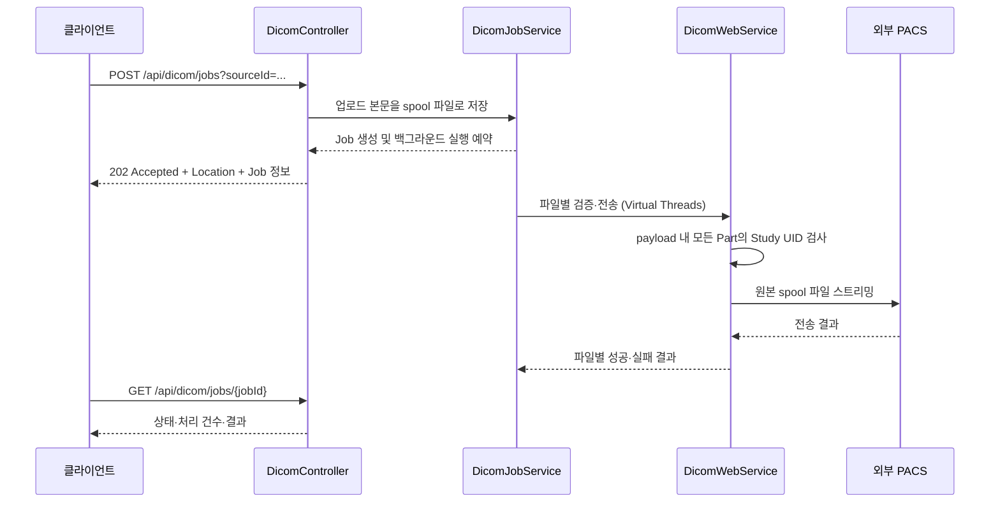
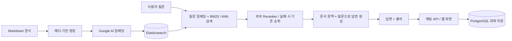

# DICOM Proxy & RAG Chat (`dicom-proxy`)

DICOM 파일의 비동기 중계·조회·C-STORE 수신과 Markdown 문서 기반 RAG 검색·채팅을 제공하는 Spring Boot 애플리케이션입니다. DICOM 처리와 문서 검색은 독립된 기능이며, 수신한 의료 영상을 자동으로 RAG에 색인하지 않습니다.

## 주요 기능

| 영역 | 기능 | 저장소 / 외부 연동 |
| --- | --- | --- |
| DICOM 전송 | `.dat` 패키지 또는 multipart 본문 업로드, 비동기 Job 실행, 진행 상태·파일별 결과 조회 | 임시 spool 파일, Caffeine Job 캐시, 외부 PACS |
| DICOM 조회 | WADO 이미지·원본 조회, Study ZIP 다운로드, 메타데이터 조회, KOS 생성 요청 중계 | 외부 PACS |
| DICOM SCP | C-ECHO, C-STORE 수신 및 디렉터리 저장, 선택적 TLS·상호 인증 | 로컬 / 마운트된 파일 저장소 |
| 문서 지식 검색 | Markdown 청킹·임베딩·색인, BM25 + kNN 검색, 작성자·공간·날짜 필터, 재순위화 | Google AI, Elasticsearch, 외부 Reranker |
| RAG 채팅 | 검색 문서를 바탕으로 답변·출처 반환, 세션 및 대화 내역 관리, 웹 화면 | Google AI, PostgreSQL, Thymeleaf |
| 운영 지원 | Swagger UI, ECS 형식 로그, Elastic APM 연동, Discord 오류 알림 | 로그 파일, APM Agent, Webhook |

영상 Purge 기능과 전용 API·데이터 모델은 제거되었습니다.

## 기술 스택

| 항목 | 현재 구성 |
| --- | --- |
| Java / 빌드 | JDK 25, Gradle Wrapper 9.3.1 |
| 애플리케이션 | Spring Boot 4.0.3, Spring MVC, JPA, Thymeleaf, Virtual Threads |
| DICOM | dcm4che 5.29.1, Spring RestClient |
| 데이터 저장 | PostgreSQL, Elasticsearch Java Client 9.3.4, Caffeine |
| AI 연동 | Google AI REST API 직접 호출, 외부 HTTP Reranker |
| 실행 | 로컬 JVM 또는 Docker Compose, 기본 HTTP 포트 `80`, SCP 포트 `11112` |

의존성은 [build.gradle](build.gradle), 실행 설정은 [application.yaml](src/main/resources/application.yaml)을 기준으로 합니다.

## 처리 흐름

### DICOM 비동기 전송


```mermaid
sequenceDiagram
    participant Client as 클라이언트
    participant API as DicomController
    participant Job as DicomJobService
    participant Forward as DicomWebService
    participant PACS as 외부 PACS
    Client->>API: POST /api/dicom/jobs?sourceId=...
    API->>Job: 업로드 본문을 spool 파일로 저장
    Job-->>API: Job 생성 및 백그라운드 실행 예약
    API-->>Client: 202 Accepted + Location + Job 정보
    Job->>Forward: 파일별 검증·전송 (Virtual Threads)
    Forward->>Forward: payload 내 모든 Part의 Study UID 검사
    Forward->>PACS: 원본 spool 파일 스트리밍
    PACS-->>Forward: 전송 결과
    Forward-->>Job: 파일별 성공·실패 결과
    Client->>API: GET /api/dicom/jobs/{jobId}
    API-->>Client: 상태·처리 건수·결과
```

1. 업로드 본문 전체를 애플리케이션 소유 임시 파일에 저장한 뒤 `202 Accepted`를 반환합니다. 업로드 자체가 끝나기 전에 응답하는 방식은 아닙니다.
2. 백그라운드에서 각 payload의 모든 DICOM Part를 검사하여 단일 Study인지 확인합니다. 여러 `.dat` 파일은 각각 검증합니다.
3. 검증된 파일을 재직렬화하거나 전체 `byte[]`로 변환하지 않고 `${BASE_URL}/hime-server/dcm/studies/{studyUid}?SourceID=...`로 스트리밍합니다.
4. 전송·spool·form 업로드 진입에 각각 동시성 제한을 적용합니다. 전송은 최대 3회 시도하며, 일반적인 4xx 응답은 재시도하지 않습니다(`408`, `429` 제외).
5. Job의 파일별 결과와 처리 건수를 갱신하고 사용한 spool 파일을 정리합니다. 시작 시 보존 기간을 넘긴 오래된 `.part` 파일도 정리합니다.

Job 상태는 `SUBMITTED`, `PROCESSING`, `COMPLETED`, `PARTIAL_SUCCESS`, `FAILED`입니다. 건수는 DICOM 인스턴스 수가 아닌 업로드 파일 / payload 수입니다. Study 불일치 등 백그라운드 검증 실패는 접수 응답 이후 Job 결과에 기록되므로, `202`만으로 전송 성공을 판단할 수 없습니다.

Job 정보는 기본 24시간, 최대 10,000건을 Caffeine 메모리 캐시에 보관합니다. 서버 재시작 시 이력은 사라지며 작업 자동 복구나 서버 간 상태 공유는 지원하지 않습니다.

### C-STORE 수신

dcm4che SCP가 수신한 파일을 임시 경로에 기록한 뒤 DICOM 태그를 읽고 다음 구조로 이동합니다.

```text
{baseDir}/{PatientID}/{StudyDate}_{StudyUID}/{SeriesUID}_{Modality}/{SOPUID}.dcm
```

`DICOM_SCP_ENABLED`로 활성화하고, AET·허용 Calling AET·포트·저장 경로를 설정합니다. TLS는 `DICOM_SCP_TLS_ENABLED`, 클라이언트 인증은 `DICOM_SCP_MTLS_ENABLED`로 설정합니다. C-STORE 수신은 파일 저장까지 수행하며 HTTP 전송 Job을 자동 생성하지 않습니다.

### 문서 색인·RAG·채팅


```mermaid
flowchart LR
    MD[Markdown 문서] --> Chunk[헤더 기반 청킹]
    Chunk --> Embed[Google AI 임베딩]
    Embed --> ES[(Elasticsearch)]
    Q[사용자 질문] --> Search[질문 임베딩 + BM25 / kNN 검색]
    ES --> Search
    Search --> Rank[외부 Reranker / 실패 시 기존 순위]
    Rank --> LLM[문서 문맥 + 질문으로 답변 생성]
    LLM --> Answer[답변 + 출처]
    Answer --> Chat[채팅 API / 웹 화면]
    Chat --> DB[(PostgreSQL 대화 저장)]
```

- **색인:** Markdown 헤더 경로를 보존해 기본 800자 단위로 나누고 150자 overlap을 추가합니다. 제목·헤더 경로를 포함한 문맥을 임베딩하여 본문·메타데이터·벡터를 함께 저장합니다.
- **검색:** 질문 임베딩과 BM25 키워드 검색을 결합하고 작성자·공간·날짜 필터를 적용합니다. 1차 후보는 `max(topK × 3, 30)`개이며, 외부 Reranker로 재정렬한 뒤 `topK`개를 반환합니다. Reranker가 비활성화되거나 실패하면 1차 순위를 사용합니다.
- **답변:** 검색 문서와 질문을 [RAG 프롬프트](src/main/resources/prompts/rag-system-prompt.txt)에 넣어 Google AI로 전달하고 답변과 출처를 반환합니다. 검색 결과가 없으면 모델 호출 없이 안내 문구를 반환합니다.
- **채팅:** 사용자 질문·모델 답변·검색 조건·출처를 PostgreSQL에 저장합니다. 이전 대화는 화면에서 조회할 수 있지만, 현재 구현은 과거 메시지를 모델 입력에 포함하지 않습니다. 답변은 스트리밍 없이 한 번에 반환합니다.

## 실행 준비

### 필수 구성

- 빌드용 **JDK 25**. 별도 Gradle 설치 없이 저장소의 `./gradlew`를 사용합니다.
- PostgreSQL과 Elasticsearch, Elasticsearch CA 인증서 및 접속 계정.
- PACS 접속 주소와 PEM 인증서·개인 키·신뢰 인증서. SCP를 끄더라도 HTTP 클라이언트의 SSL bundle 구성이 필요합니다.
- 문서 색인·검색·답변 생성에 사용할 Google AI API 키.
- Docker 실행 시 Docker Compose v2와 `agent/elastic-apm-agent.jar`. Agent 바이너리는 저장소에 포함되지 않으므로 별도로 준비합니다.

[docker-compose.yml](docker-compose.yml)은 애플리케이션 컨테이너만 실행합니다. PostgreSQL·Elasticsearch·Reranker 서버는 별도로 준비해야 합니다. Reranker 서버 코드는 이 저장소에 포함되어 있지 않습니다.

### DB 및 검색 인덱스

JPA의 `ddl-auto`는 `none`입니다. 스키마 자동 생성이나 마이그레이션 파일이 없으므로 [ChatSession](src/main/java/dev/ioexception/dicom/domain/chat/ChatSession.java)과 [ChatMessage](src/main/java/dev/ioexception/dicom/domain/chat/ChatMessage.java)에 맞는 `chat_session`, `chat_message` 테이블을 먼저 준비합니다.

애플리케이션 시작 시 `confluence_wiki` 인덱스 생성과 `knowledge_search_alias` 연결을 시도합니다. 기존 인덱스의 매핑을 변경하지는 않습니다. 벡터 매핑은 **768차원**으로 고정되어 있으므로 임베딩 출력 차원도 맞춰야 합니다.

`wiki` 색인은 `confluence_wiki`, `blog` 색인은 `tech_blog`를 사용합니다. `blog`를 사용하려면 [색인 서비스의 매핑](src/main/java/dev/ioexception/dicom/service/ConfluenceIngestionService.java)을 기준으로 `tech_blog`를 준비하고 `knowledge_search_alias`에 연결해야 합니다. 현재 자동 초기화 대상은 `confluence_wiki`뿐입니다.

### 환경변수

새 환경에서는 [.env.example](.env.example)을 복사한 뒤 접속 정보와 경로를 채웁니다. 아래 명령은 기존 `.env`를 덮어쓰지 않습니다.

```bash
cp -n .env.example .env
```

`.env`와 `.env.*`는 Git 추적에서 제외되며 `.env.example`만 공유합니다. 예시의 비밀번호·API 키·Webhook URL은 실제 값으로 바꿔 로컬 `.env`에 보관합니다.

| 설정 | 역할 / 기본값 |
| --- | --- |
| `BASE_URL` | 중계할 PACS 서버 주소 |
| `CERTIFICATE_PATH`, `PRIVATE_KEY_PATH`, `CERTIFICATE_PASSWORD`, `CLIENT_CA_PATH` | 애플리케이션 SSL bundle 인증서·키·신뢰 인증서 |
| `DOCKER_POSTGRESQL_DATASOURCE_URL` | Compose에서 앱의 `POSTGRESQL_DATASOURCE_URL`로 전달할 JDBC URL |
| `POSTGRESQL_DATASOURCE_URL`, `POSTGRESQL_DATASOURCE_USERNAME`, `POSTGRESQL_DATASOURCE_PASSWORD` | 로컬 JVM의 JDBC URL 및 공통 DB 계정 |
| `SPRING_ELASTICSEARCH_URIS`, `SPRING_ELASTICSEARCH_USERNAME`, `SPRING_ELASTICSEARCH_PASSWORD`, `CAPATH` | Elasticsearch 접속 정보 및 앱에서 읽을 CA 파일 |
| `GOOGLE_AI_API_KEY`, `GOOGLE_AI_EMBEDDING_MODEL`, `GOOGLE_AI_CHAT_MODEL` | API 키 및 모델. 현재 설정값은 `gemini-embedding-2`, `gemini-3.5-flash-lite` |
| `GOOGLE_AI_OUTPUT_DIMENSIONALITY` | 임베딩 차원, `768` |
| `MAX_DICOM_REQUEST`, `DICOM_FORWARD_MAX_CONCURRENT_SPOOLS` | 전송·spool 동시 처리 상한, 각각 `10` |
| `DICOM_FORWARD_MAX_SPOOL_SIZE`, `DICOM_FORWARD_MIN_FREE_DISK_SPACE` | payload 크기 상한·최소 여유 공간, 각각 `5GB` |
| `DICOM_FORWARD_MAX_METADATA_SCAN_SIZE`, `DICOM_FORWARD_MAX_STOW_RESPONSE_SIZE` | Part별 메타데이터 스캔 상한 `8MB`, 타겟 응답 상한 `1MB` |
| `DICOM_FORWARD_SPOOL_DIR`, `DICOM_FORWARD_STALE_SPOOL_RETENTION` | 임시 저장 위치·시작 시 오래된 파일 정리 기준, `24h` |
| `DICOM_FORWARD_JOB_RETENTION`, `DICOM_FORWARD_JOB_MAX_ENTRIES` | Job 캐시 보존 기간 `24h`, 최대 `10000`건 |
| `DICOM_FORWARD_ADMISSION_ENABLED`, `DICOM_FORWARD_MAX_CONCURRENT_UPLOADS` | form 업로드 진입 제한, `true` / `10` |
| `DICOM_SCP_ENABLED`, `DICOM_SCP_AET`, `DICOM_SCP_ALLOWED_AETS`, `DICOM_SCP_PORT` | SCP 수신 설정. YAML 기본 활성화, `.env.example`에서는 비활성화 |
| `DICOM_SCP_TLS_ENABLED`, `DICOM_SCP_MTLS_ENABLED` | SCP TLS·클라이언트 인증, 기본 `false` |
| `DISCORD_WEBHOOK_URL` | 오류 알림을 보낼 Discord Webhook |

form 업로드에는 Spring multipart 제한(파일당 `2GB`, 요청당 `5GB`)도 적용됩니다. 전체 환경변수 목록과 마운트·포트 설정은 `.env.example`을 확인합니다.

Compose의 `.env`는 변수 치환에 사용되며 모든 값이 자동으로 컨테이너에 전달되지는 않습니다. 현재 Job 캐시·업로드 진입 제한 변수는 Compose `environment`에 없으므로 컨테이너에서 기본값을 변경하려면 전달 항목도 추가해야 합니다. Reranker 설정 `APP_RERANKER_URL`(기본 `http://localhost:8000/rerank`)과 `APP_RERANKER_ENABLED`(기본 `true`)도 같은 방식으로 추가합니다. 컨테이너의 `localhost`는 컨테이너 자신을 가리킵니다.

### Docker Compose 실행

`.env`의 호스트 경로(`CERTS_DIR`, `ES_CA_PATH`, `DICOM_SCP_BASE_DIR`)와 컨테이너 경로를 구분해 설정합니다. Compose는 `DICOM_SCP_CONTAINER_DIR`를 앱 내부의 `DICOM_SCP_BASE_DIR`로 전달합니다. `PACS_HOST_MAPPING`도 실제 PACS 위치에 맞춰 수정합니다.

인증서 파일과 DB 스키마, `agent/elastic-apm-agent.jar`를 준비한 뒤 실행합니다.

```bash
./gradlew clean bootJar
docker compose --env-file .env config --quiet
docker compose --env-file .env up -d --build
```

Dockerfile은 Java 소스를 빌드하지 않고 `build/libs/*.jar`를 복사합니다. 따라서 먼저 `clean bootJar`로 실행 JAR 하나를 준비해야 합니다. `.env.example`의 `JAVA_OPTS`는 TLS 1.2·1.3을 지정하며, Dockerfile 자체에는 레거시 TLS 설정이 남아 있습니다.

기본 포트 매핑 기준 접속 주소:

- 채팅 화면: <http://localhost/chat>
- Swagger UI: <http://localhost/swagger-ui.html>
- OpenAPI JSON: <http://localhost/v3/api-docs>

### 로컬 JVM 실행

`bootRun`은 `.env`를 자동으로 읽지 않습니다. IDE의 실행 환경변수에 등록하거나, 신뢰하는 로컬 `.env`를 아래처럼 읽습니다. 먼저 인증서·spool·SCP 경로를 로컬 경로로, DB·Elasticsearch 주소를 로컬에서 접근 가능한 주소로 수정해야 합니다. 예제의 `/app/...` 경로는 컨테이너용입니다.

```bash
set -a
. ./.env
set +a
SERVER_PORT=8080 ./gradlew bootRun
```

이 경우 채팅과 Swagger 주소는 각각 `http://localhost:8080/chat`, `http://localhost:8080/swagger-ui.html`입니다.

## API 사용

아래 예시는 기본 HTTP 포트 `80` 기준입니다. 실제 DTO와 전체 파라미터는 Swagger UI에서 확인할 수 있습니다.

### DICOM API

| 메서드 | 경로 | 용도 / 주요 파라미터 |
| --- | --- | --- |
| POST | `/api/dicom/jobs` | 전송 접수. 필수 `sourceId`, form 필드 `files` 또는 직접 multipart 본문 |
| GET | `/api/dicom/jobs/{jobId}` | 상태·결과 조회. 없거나 만료된 Job은 `404` |
| POST | `/api/dicom/forward-async` | 이전 호환 API. 기본 `202` 반환, 신규 연동은 `/jobs` 사용 |
| GET | `/api/dicom/wado` | `studyUID`, `seriesUID`, `objectUID`, 선택적 `sourceId`, `contentType` |
| GET | `/api/dicom/studies/{studyUID}/zip` | 외부 PACS의 ZIP 스트리밍. 필수 `patientId` |
| GET | `/api/dicom/studies/{studyUID}/metadata` | 필수 `patientId`, `format=json/xml/html`, `includePrivate`, `groups`, `xsl` |
| GET | `/api/dicom/studies/{studyUID}/kos/{kosUID}` | 외부 PACS의 KOS 생성 요청. 필수 `sourceId`, 선택적 `hasReport`, `totalInstanceCount` |

요청 파라미터는 소문자로 시작하는 **`sourceId`**입니다. 외부 PACS에 전달할 때는 `SourceID`로 변환합니다. WADO 기본 형식은 `image/jpeg`이며 원본은 `contentType=application/dicom`으로 요청합니다. 메타데이터의 `html` 형식은 `xsl`이 필요합니다.

```bash
# 같은 요청에 files를 여러 번 추가할 수 있습니다.
curl -i -X POST 'http://localhost/api/dicom/jobs?sourceId=1.2.3' \
  -F 'files=@study.dat'

# 202 응답의 Location 또는 jobId로 상태를 조회합니다.
curl 'http://localhost/api/dicom/jobs/JOB_ID'
```

`study.dat`는 DICOM 파일을 담은 MIME multipart 패키지입니다. 개별 `.dcm`의 확장자만 바꾼 파일이 아닙니다. 응답에는 `jobId`, `status`, `totalFiles`, `processedFiles`, `successCount`, `failureCount`, `results`, `errorMessage`, 생성·시작·완료 시각 등이 포함됩니다.

### 지식 색인·검색 API

| 메서드 | 경로 | 용도 |
| --- | --- | --- |
| POST | `/api/v1/knowledge/ingest/{category}` | Markdown 색인. `category`는 `wiki` 또는 `blog` |
| POST | `/api/v1/knowledge/search` | 검색 결과 반환 |
| POST | `/api/v1/knowledge/ask` | RAG 답변과 출처 반환 |
| GET | `/api/v1/knowledge/metadata-options` | 색인된 작성자·공간 필터 옵션 조회 |

색인 예시:

```bash
curl -X POST 'http://localhost/api/v1/knowledge/ingest/wiki' \
  -H 'Content-Type: application/json' \
  --data-binary @- <<'JSON'
{
  "title": "서비스 운영 안내",
  "sourceUrl": "https://docs.example.com/service-guide",
  "spaceKey": "DEMO",
  "author": "demo",
  "createdAt": "2026-01-01T00:00:00Z",
  "markdownContent": "# 서비스 운영\n\n## 상태 조회\n전송 접수 후 Job ID로 처리 상태를 확인합니다.",
  "extraMetadata": {}
}
JSON
```

질문 예시(`ask`를 `search`로 바꾸면 검색 결과만 반환):

```bash
curl -X POST 'http://localhost/api/v1/knowledge/ask' \
  -H 'Content-Type: application/json' \
  -d '{"query":"전송 상태는 어떻게 확인하나요?","topK":8,"spaceKey":"DEMO"}'
```

검색·질문·채팅 요청에는 양수 `topK`를 명시합니다. 현재 검색 서비스는 `topK` 생략 시 오류가 발생할 수 있습니다. 선택 필터는 `author`, `spaceKey`, `startDate`, `endDate`이며 날짜는 ISO 형식을 사용합니다. 출처에는 문서 제목·섹션·헤더 경로·본문·원문 URL·점수가 포함됩니다.

### 채팅 API 및 화면

| 메서드 | 경로 | 용도 |
| --- | --- | --- |
| GET | `/chat` | 세션 목록·대화·검색 필터·출처를 표시하는 웹 화면 |
| GET / POST | `/api/v1/chat/sessions` | 세션 목록 조회 / 생성 |
| DELETE | `/api/v1/chat/sessions/{id}` | 세션 및 메시지 삭제 |
| GET | `/api/v1/chat/sessions/{id}/messages` | 대화 내역 조회 |
| POST | `/api/v1/chat/send` | 질문 저장 → RAG 실행 → 답변 저장·반환 |

```bash
curl -X POST 'http://localhost/api/v1/chat/send' \
  -H 'Content-Type: application/json' \
  -d '{"sessionId":null,"query":"전송 상태는 어떻게 확인하나요?","topK":8}'
```

`sessionId`가 없으면 세션을 생성합니다. 기존 세션에 이어 쓰려면 세션 ID를 전달합니다. 채팅도 지식 검색 API와 같은 검색 필터를 받습니다. 현재 사용자 인증·사용자별 세션 소유권 구분은 구현되어 있지 않습니다.

## 보조 스크립트

| 파일 | 역할 | 의존성 |
| --- | --- | --- |
| [organize_and_pack_dat.py](organize_and_pack_dat.py) | DICOM 파일을 Study별 `.dat` 패키지로 묶음 | `pydicom` |
| [confluence_to_md.py](confluence_to_md.py) | Confluence에서 내보낸 HTML 기반 `.doc`를 Markdown으로 변환 | `beautifulsoup4`, `markdownify` |
| [html_to_md.py](html_to_md.py) | 웹 문서 본문을 추출하여 Markdown으로 저장 | `trafilatura` |

```bash
python3 -m pip install pydicom beautifulsoup4 markdownify trafilatura
python3 organize_and_pack_dat.py ./dicom-input ./output-dats
python3 confluence_to_md.py -i ./export.doc -o ./document.md
```

`html_to_md.py`는 URL과 출력 파일명이 코드에 지정되어 있으므로 실행 전에 수정해야 합니다. 변환된 Markdown은 색인 API의 `markdownContent`로 전달합니다. Confluence 자동 동기화는 제공하지 않으며, 같은 문서를 다시 색인하면 새 청크가 추가됩니다. 문서 교체·삭제·중복 제거 API는 없습니다.

## 코드 위치와 테스트

| 경로 (`src/main` 기준) | 역할 |
| --- | --- |
| `java/dev/ioexception/dicom/controller/` | DICOM·지식·채팅 API와 화면 컨트롤러 |
| `java/dev/ioexception/dicom/controller/swagger/` | API 경로·요청 규격·Swagger 문서 |
| `java/dev/ioexception/dicom/service/dicom/` | Job 관리, 파일 저장, PACS 중계 |
| `java/dev/ioexception/dicom/presentation/scp/` | C-ECHO·C-STORE 및 SCP TLS 설정 |
| `java/dev/ioexception/dicom/service/Confluence*` | 문서 색인·검색·RAG 처리 |
| `java/dev/ioexception/dicom/service/ChatService.java` | 세션·메시지 저장과 RAG 연결 |
| `java/dev/ioexception/dicom/common/client/` | Google AI·Reranker 클라이언트 |
| `java/dev/ioexception/dicom/domain/`, `repository/` | Job·채팅 모델 및 캐시·DB·검색 접근 |
| `resources/templates/chat.html`, `resources/static/` | 채팅 화면·JavaScript·CSS |
| `resources/prompts/rag-system-prompt.txt` | 답변 생성 프롬프트 |

테스트는 `src/test/java`에 있으며 Job 상태, 전송·spool 제한, multipart 검증, 업로드 진입 제한, 오류 응답, SCP 설정 등을 검증합니다. DICOM 기능의 주요 회귀 테스트는 다음과 같이 실행할 수 있습니다.

```bash
./gradlew test \
  --tests 'dev.ioexception.dicom.controller.*' \
  --tests 'dev.ioexception.dicom.service.dicom.*' \
  --tests 'dev.ioexception.dicom.common.*' \
  --tests 'dev.ioexception.dicom.config.*' \
  --tests 'dev.ioexception.dicom.exception.*' \
  --tests 'dev.ioexception.dicom.presentation.*' \
  --tests 'dev.ioexception.dicom.DicomApplicationTests'
```

외부 PACS·DB·Elasticsearch·Google AI까지 연결한 동작은 별도 환경에서 확인해야 합니다. 기존 Header Peek 구현의 성능 측정치는 현재 비동기 spool 구현의 성능을 나타내지 않으므로 이 문서에서 제외했습니다.

## License

Copyright © 2026 dev.ioexception. All rights reserved.
